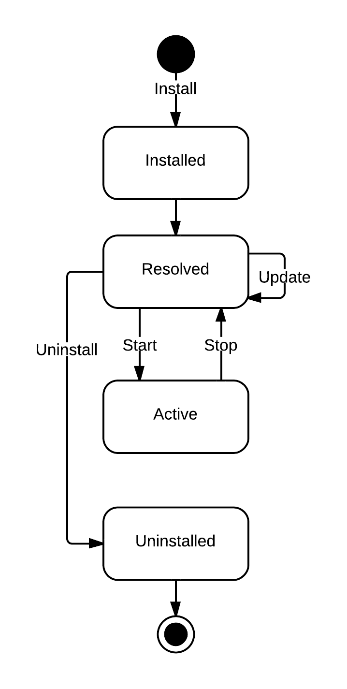

.. _refcard_bundles:

Bundles
=======

A bundle is a Python module installed using the Pelix
:meth:`Framework <pelix.framework.Framework.install_bundle>` instance or a
:meth:`BundleContext <pelix.framework.BundleContext.install_bundle>` object.

Each bundle is associated to an ID, an integer that is unique for a framework
instance, and to a symbolic name, *i.e.* its module name.
The framework itself is seen as the bundle which ID is always 0.

Because installing a bundle is in fact importing a module,
**no code should be written to be executed at module-level** (except the
definition of constants, the import of dependencies, ...).
Initialization must be done in the bundle activator (see below).

Life-cycle
----------

Unlike a module, a bundle has a life-cycle and can be in one of the following
states:

=========== ===================================================================================================
State       Description
=========== ===================================================================================================
INSTALLED   The Python module has been correctly imported, the bundle goes to the RESOLVED state
RESOLVED    The bundle has not been started yet or has been stopped
*STARTING*  The :meth:`~pelix.constants.BundleActivator.start` method of the bundle activator is being called (transition to ACTIVE or RESOLVED)
ACTIVE      The bundle activator has been called and didn't raise any error
*STOPPING*  The :meth:`~pelix.constants.BundleActivator.stop` method of the bundle activator is being called (transition to RESOLVED)
UNINSTALLED The bundle has been removed from the framework (only visible by remaining references to the bundle)
=========== ===================================================================================================

The update process of a bundle is simple:

* if it was active, the bundle is stopped: other bundles are notified of this
  transition, and its services are unregistered
* the module is updated, using the
  `imp.reload() <https://docs.python.org/3/library/imp.html#imp.reload>`_ method

  * if the update fails, the previous version of the module is kept, but the bundle is not restarted.
* if the update succeeds and the bundle was active, the bundle its restarted

Bundle Activator
----------------

A bundle activator is a class defining the
:meth:`~pelix.constants.BundleActivator.start` and
:meth:`~pelix.constants.BundleActivator.stop` methods, which are called by the
framework according to the bundle life-cycle.

.. class:: pelix.constants.BundleActivator

   This decorator must be applied to the class that will be notified of the
   life-cycle events concerning the bundle.
   A bundle can only have one activator, which must implement the following
   methods:

   .. py:method:: start(context)

      This method is called when the bundle is in *STARTING* state. If this
      method doesn't raise an exception, the bundle goes immediately into the
      *ACTIVE* state.
      If an exception is raised, the bundle is stopped.

      During the call of this method, the framework is locked. It is therefore
      necessary that this method returns as soon as possible: all time-consuming
      tasks should be executed in a new thread.

   .. py:method:: stop(context)

      This method is called when the bundle is in *STOPPING* state.
      After this method returns or raises an exception, the bundle goes into the
      *RESOLVED* state.

      All resources consumed by the bundle should be released before this method
      returns.

A class is defined as the bundle activator if it is decorated with
``@BundleActivator``, as shown in the following snippet:

.. code-block:: python

   import pelix.constants

   @pelix.constants.BundleActivator
   class Activator(object):
       """
       Bundle activator template
       """
       def start(self, context):
           """
           Bundle is starting
           """
           print("Start")

       def stop(self, context):
            """
            Bundle is stopping
            """
            print("Stop")

.. note::

   The previous declaration of the activator, *i.e.* declaring an ``activator``
   module member, is deprecated and its support will be removed in version 1.0.

Bundle Context
--------------

A context is associated to each bundle, and allows it to interact with the
framework.
It is unique for a bundle until it is removed from the framework.
It must be used to register and to look up services, to request framework
information, etc.

All the available methods are described in the
:ref:`API chapter <api_bundlecontext>`.
Here are the most used ones concerning the handling of bundles:

.. autoclass:: pelix.framework.BundleContext
   :members: get_bundle, get_bundles, install_bundle, add_bundle_listener,
             remove_bundle_listener, install_package, install_visiting
